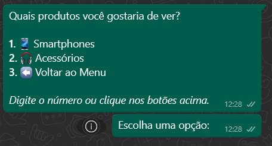

<div align="center">

# 🤖 WhatsApp Sales Bot

### 🚀 Bot de Vendas Automatizado com WhatsApp Business API

[](https://nodejs.org/)
[](LICENSE)
[](https://www.whatsapp.com/business)
[](https://github.com/WhiskeySockets/Baileys)

**Automatize suas vendas no WhatsApp com um bot profissional, completo e fácil de usar!**

**🚀 Desenvolvido com [Baileys](https://github.com/WhiskeySockets/Baileys)** - Biblioteca não-oficial do WhatsApp com suporte completo a QR Code e autenticação

[⭐ Dê uma estrela](#) • [📖 Documentação](#-documentação) • [🐛 Reportar Bug](#-problemas) • [💡 Sugerir Feature](#-contribuindo)

---

## 🤖 Sobre o Bot

O **WhatsApp Sales Bot** é um bot de vendas completo e profissional que automatiza todo o processo de vendas no WhatsApp. Desenvolvido com **Node.js** e **Baileys**, oferece uma experiência de compra fluida diretamente na conversa do WhatsApp.

### 🎯 O que este bot faz?

- 🛒 **Carrinho de Compras Completo** - Clientes adicionam produtos, veem o carrinho e finalizam pedidos
- 💰 **Sistema de Cupons** - Aplicação automática de cupons de desconto (percentual ou fixo)
- 📱 **Catálogo Interativo** - Navegação por categorias com botões e listas intuitivas
- 🔍 **Busca Inteligente** - Correção automática de erros de digitação
- 📊 **Painel Administrativo** - Gerencie produtos, estoque e cupons diretamente pelo WhatsApp
- ✅ **Validação em Tempo Real** - Verificação de estoque antes da compra
- 🎟️ **Ofertas Especiais** - Seção dedicada para produtos em promoção
- 📝 **Logs Completos** - Sistema de auditoria profissional

### 💡 Por que usar este bot?

| Benefício                   | Descrição                                       |
| --------------------------- | ----------------------------------------------- |
| 🚀 **Rápido de Configurar** | Conecte via QR Code em minutos                  |
| 💰 **Gratuito**             | Open source, sem custos de licença              |
| 🔒 **Seguro**               | Rate limiting, sanitização e validação completa |
| ⚡ **Performance**          | Cache inteligente e otimizações                 |
| 📱 **Fácil de Usar**        | Interface intuitiva com botões e menus          |
| 🔧 **Customizável**         | Fácil de adaptar para suas necessidades         |
| 📊 **Profissional**         | Logs estruturados e monitoramento               |
| 🎯 **Completo**             | Do catálogo ao checkout, tudo integrado         |

### 🎬 Como Funciona?

1. **Cliente inicia conversa** → Bot envia mensagem de boas-vindas personalizada
2. **Navega pelo catálogo** → Escolhe categoria, vê produtos com imagens
3. **Adiciona ao carrinho** → Digita código do produto ou usa comandos
4. **Aplica cupom** → Se houver cupom disponível
5. **Finaliza pedido** → Bot valida estoque e notifica vendedor
6. **Vendedor confirma** → Processa pagamento e entrega

### 🧪 Testes Automatizados e Scripts

### ✅ Testes Automatizados do Bot

Este projeto agora inclui **um sistema de testes automáticos que valida todas as principais funções do bot** antes de você ir para produção:

- Dialogo completo: menu, categorias, produtos, carrinho, ofertas, suporte, admin
- Respostas, botões, imagens e fluxo de conversação
- Gerenciamento de estado e deduplicação de mensagens
- Testes de estoque, cupons, carrinho vazio, produtos inválidos e navegação

#### 📊 Como executar os testes automáticos (recomendado SEM WhatsApp!)

```bash
npm test
```

Ou diretamente:

```bash
node testes/teste-automatico.js
```

- O script **NÃO usa Baileys nem seu WhatsApp** (execução totalmente offline/simulada)
- Exibe um relatório (verde: passou, vermelho: falhou)
- Valida todo o fluxo principal igual o uso real do bot

Para detalhes completos dos cenários e checklist de testes manuais:

- [🧪 Guia de Testes Detalhado](TESTES_BOT.md)
- [📋 Checklist/Resumo Funcional](VERIFICACAO_FUNCIONALIDADES.md)

#### ⚡ Scripts PowerShell para iniciar/parar o bot (Windows)

- **iniciar_bot.ps1:** encerra quaisquer Node.js anteriores e sobe o bot
- **parar_bot.ps1:** encerra todos processos Node.js do bot

Exemplo de uso (PowerShell):

```powershell
./parar_bot.ps1           # Para o bot e limpa processos antigos
./iniciar_bot.ps1         # Sobe o bot na pasta correta
```

_Se preferir via npm:_

```bash
npm start           # Sobe o bot normalmente
npm run dev         # Sobe em modo desenvolvimento (auto-reload)
```

---

### 🏆 Principais Destaques

<div align="center">

| Feature                | Status | Descrição                               |
| ---------------------- | ------ | --------------------------------------- |
| 🤖 Bot Completo        | ✅     | Sistema completo de vendas automatizado |
| 📱 Integração WhatsApp | ✅     | Via Baileys com QR Code                 |
| 🛒 Carrinho de Compras | ✅     | Completo com cupons e validação         |
| 🔐 Painel Admin        | ✅     | Gerenciamento via WhatsApp              |
| ⚡ Performance         | ✅     | Cache e otimizações                     |
| 🔒 Segurança           | ✅     | Rate limiting e sanitização             |
| 📝 Logs                | ✅     | Sistema profissional de auditoria       |

</div>

---

## 🔑 Tecnologias Principais

<div align="center">

### 📱 Baileys - WhatsApp API

**Biblioteca não-oficial mais completa e robusta para WhatsApp**


- ✅ **Autenticação via QR Code** - Conecte facilmente escaneando o QR Code
- ✅ **Suporte Completo** - Mensagens, botões, listas, imagens, documentos
- ✅ **Multidevice** - Suporte nativo para múltiplos dispositivos
- ✅ **Robusto** - Reconexão automática e tratamento de erros
- ✅ **Atualizado** - Mantido ativamente pela comunidade

**Repositório:** [WhiskeySockets/Baileys](https://github.com/WhiskeySockets/Baileys)

</div>

---

</div>

## 📸 Preview / Demonstração

### 🎬 Interface do Bot

<!-- Adicione screenshots do bot em funcionamento aqui -->
<div align="center">

**Conversa do Cliente**


_Screenshot da conversa do cliente interagindo com o bot_

**Painel Admin**


_Screenshot do painel administrativo gerenciando produtos_

**Dashboard de Estatísticas**


_Screenshot do dashboard com estatísticas de vendas_

</div>

### 📊 Arquitetura do Sistema

<!-- Adicione diagrama de arquitetura/fluxo aqui -->
<div align="center">


_Diagrama mostrando a arquitetura completa do bot_

</div>

### 🔄 Fluxo Automatizado (n8n)

<!-- Adicione gráfico do fluxo n8n aqui -->
<div align="center">


_Gráfico profissional do fluxo automatizado no n8n_

</div>

---

## ✨ Funcionalidades Completas

<div align="center">

### 📊 **29+ Funcionalidades Implementadas e Testadas**

| Categoria                      | Quantidade              | Status |
| ------------------------------ | ----------------------- | ------ |
| 🛍️ **Para Clientes**           | 8 funcionalidades       | ✅     |
| 🔐 **Para Administradores**    | 6 funcionalidades       | ✅     |
| ⚡ **Performance & Segurança** | 6 funcionalidades       | ✅     |
| 💬 **Experiência do Usuário**  | 4 funcionalidades       | ✅     |
| 🛠️ **Melhorias Técnicas**      | 5+ funcionalidades      | ✅     |
| **📊 TOTAL**                   | **29+ funcionalidades** | ✅     |

</div>

---

### 🛍️ Para Clientes (8 funcionalidades)

| Funcionalidade              | Descrição                                               | Status |
| --------------------------- | ------------------------------------------------------- | ------ |
| 🛒 **Carrinho de Compras**  | Adicione produtos ao carrinho diretamente pelo WhatsApp | ✅     |
| 💰 **Cupons de Desconto**   | Sistema completo de cupons (percentual ou fixo)         | ✅     |
| 📱 **Catálogo Interativo**  | Navegue por categorias e produtos com botões intuitivos | ✅     |
| 🔍 **Busca Inteligente**    | Corrige erros de digitação automaticamente              | ✅     |
| 📄 **Paginação**            | Navegue grandes listas com páginas numeradas            | ✅     |
| 👁️ **Visualização Rápida**  | Veja detalhes do produto com comando rápido             | ✅     |
| 🎟️ **Ofertas Especiais**    | Seção dedicada para produtos em promoção                | ✅     |
| ✅ **Validação de Estoque** | Verificação em tempo real antes da compra               | ✅     |

### 🔐 Para Administradores (6 funcionalidades)

| Funcionalidade            | Descrição                                | Status |
| ------------------------- | ---------------------------------------- | ------ |
| ➕ **Cadastrar Produtos** | Cadastre produtos completos via WhatsApp | ✅     |
| ✏️ **Editar Produtos**    | Atualize preço, estoque, descrição, etc. | ✅     |
| 🗑️ **Deletar Produtos**   | Remova produtos do catálogo facilmente   | ✅     |
| 📦 **Listar Produtos**    | Veja todos os produtos cadastrados       | ✅     |
| 🎟️ **Gerenciar Cupons**   | Crie e gerencie cupons de desconto       | ✅     |
| 📊 **Logs Estruturados**  | Sistema completo de auditoria e logs     | ✅     |

### ⚡ Performance & Segurança (6 funcionalidades)

| Funcionalidade                 | Descrição                                        | Status |
| ------------------------------ | ------------------------------------------------ | ------ |
| 🚀 **Cache Inteligente**       | Cache de produtos para resposta ultra-rápida     | ✅     |
| 🛡️ **Rate Limiting**           | Proteção anti-spam e ataques                     | ✅     |
| 🔒 **Sanitização**             | Todos os inputs são validados e sanitizados      | ✅     |
| 🔄 **Retry Automático**        | Sistema robusto de retry com backoff exponencial | ✅     |
| 📝 **Logs Estruturados**       | Logs profissionais com Winston (rotação diária)  | ✅     |
| 🎯 **Validação em Tempo Real** | Validação de estoque e dados em tempo real       | ✅     |

### 💬 Experiência do Usuário (4 funcionalidades)

| Funcionalidade                    | Descrição                                    | Status |
| --------------------------------- | -------------------------------------------- | ------ |
| 👋 **Boas-vindas Personalizadas** | Mensagens personalizadas para novos clientes | ✅     |
| ✍️ **Correção de Erros**          | Corrige erros de digitação automaticamente   | ✅     |
| 📨 **Agrupamento de Mensagens**   | Reduz spam agrupando mensagens               | ✅     |
| 🎨 **Interface Intuitiva**        | Botões e listas para navegação fácil         | ✅     |

### 🛠️ Melhorias Técnicas Implementadas (5+ funcionalidades)

| Funcionalidade                     | Descrição                                       | Status |
| ---------------------------------- | ----------------------------------------------- | ------ |
| 📝 **Sistema de Logs Estruturado** | Winston com rotação diária e logs separados     | ✅     |
| 💾 **Persistência de Dados**       | Cache em memória com invalidação automática     | ✅     |
| 🔄 **Estado de Conversação**       | State machine robusto para gerenciar fluxos     | ✅     |
| 📨 **Transferência para Humano**   | Notificação automática de pedidos para vendedor | ✅     |
| 🔌 **Integração WhatsApp**         | Via Baileys com suporte completo a QR Code      | ✅     |
| 📦 **Armazenamento JSON**          | Produtos e cupons em arquivos JSON              | ✅     |

---

## 🚀 Início Rápido

### 📋 Pré-requisitos

- ✅ Node.js 18+ instalado
- ✅ WhatsApp Business ou conta pessoal do WhatsApp
- ✅ Conexão com internet

### 🔧 Instalação

#### 1️⃣ Clone o repositório

```bash
git clone https://github.com/seu-usuario/whatsapp-sales-bot.git
cd whatsapp-sales-bot
```

#### 2️⃣ Instale as dependências

```bash
npm install
```

#### 3️⃣ Configure o arquivo `.env`

Crie um arquivo `.env` na raiz do projeto:

```env
# Nome da sua loja
BOT_NAME=Sua Loja

# Números de administradores (separados por vírgula)
# Use o número completo com código do país (ex: 5511999999999)
ADMIN_NUMBERS=5511999999999,5511888888888

# WhatsApp do vendedor humano (será notificado sobre pedidos)
VENDEDOR_HUMANO_JID=5511999999999@s.whatsapp.net

# Configurações de Rate Limiting (opcional)
RATE_LIMIT_MAX_REQUESTS=10
RATE_LIMIT_WINDOW_MS=60000
RATE_LIMIT_BLOCK_MS=300000

# Configurações de Agrupamento de Mensagens (opcional)
MESSAGE_BATCH_DELAY=500
MESSAGE_BATCH_SIZE=3
USE_MESSAGE_BATCHING=true

# Nível de Log (opcional)
LOG_LEVEL=info
```

#### 4️⃣ Inicie o bot

```bash
npm start
```

**Para desenvolvimento com auto-reload:**

```bash
npm run dev
```

#### 5️⃣ Conecte seu WhatsApp via QR Code

O bot utiliza **Baileys** para autenticação via QR Code. Siga os passos:

1. **Execute o bot** - Um QR Code será exibido no terminal automaticamente
2. **Abra o WhatsApp** no seu celular
3. **Vá em** **Configurações > Aparelhos conectados > Conectar um aparelho**
4. **Escaneie o QR Code** exibido no terminal
5. **Aguarde a confirmação:** `✅ Conectado ao WhatsApp com sucesso!`

<div align="center">

**Exemplo do QR Code no Terminal:**

```
📱 Escaneie o QR Code abaixo com o WhatsApp:

████████████████████████████████
████████████████████████████████
████ ▄▄▄▄▄ █▀█ █▄█▄▀█ ▄▄▄▄▄ ████
████ █   █ █▀▀▀█ ▄▀▀▀█ █   █ ████
████ █▄▄▄█ █▀ █▀▀█ █▀ █ █▄▄▄█ ████
████▄▄▄▄▄▄▄█▄▀ ▀▄█▄▀ ▀▄█▄▄▄▄▄▄▄███
████▄▄  ▄▀█▄▄█▄▄▀▄▄█▄▄ ▄▄ ▄ ▄████
████▀ ▄ ▀▄█▀▄▀█▄█▄▀█ ▄▄▀▄▄▀▀▄▄████
████ █▄▄▄█▄▀█▀█▄▀▄█▄▀▄█▄▄ ▄█▀▄████
████ ▄▄▄▄▄ █▄█▄▀ ▀▄█▄█▄█ █ ▄▀▄████
████████████████████████████████
████████████████████████████████

✅ Conectado ao WhatsApp com sucesso!
🤖 Bot pronto para receber mensagens!
```

</div>

**Nota:** O QR Code expira após alguns minutos. Se expirar, o bot gerará um novo automaticamente.

---

## 📖 Documentação

### 🎯 Como Usar (Cliente)

#### Primeira Interação

1. Envie qualquer mensagem para o número conectado
2. Receba uma mensagem de boas-vindas personalizada
3. Navegue pelo menu usando os botões ou digite o número

#### Navegando pelos Produtos

```
📱 Menu Principal
├── 1️⃣ Ver Produtos
│   ├── 📱 Smartphones
│   │   ├── 🤖 Android
│   │   └── 🍎 iPhone
│   └── 🎧 Acessórios
│       ├── 🔌 Cabos
│       ├── 🔋 Carregadores
│       └── 🎧 Fones
├── 2️⃣ Ofertas da Semana
├── 3️⃣ Manutenção / Suporte
├── 4️⃣ Nossa Loja Física
└── 5️⃣ Falar com a Equipe
```

#### Comandos Disponíveis

| Comando             | Descrição                         | Exemplo            |
| ------------------- | --------------------------------- | ------------------ |
| `ver [CÓDIGO]`      | Ver detalhes rápidos do produto   | `ver A01`          |
| `detalhes [CÓDIGO]` | Ver detalhes completos do produto | `detalhes I02`     |
| `[CÓDIGO]`          | Adicionar produto ao carrinho     | `A01`              |
| `carrinho`          | Ver carrinho e finalizar pedido   | `carrinho`         |
| `cupom [CÓDIGO]`    | Aplicar cupom de desconto         | `cupom DESCONTO10` |
| `v` ou `voltar`     | Voltar ao menu anterior           | `v`                |
| `próxima`           | Próxima página (em listas)        | `próxima`          |
| `anterior`          | Página anterior (em listas)       | `anterior`         |

### 🔐 Modo Administrador

Para acessar o painel administrativo, envie: `admin` ou `/admin`

#### Funcionalidades Admin

```
🔐 Painel Administrativo
├── 1️⃣ Cadastrar Produto
│   └── Fluxo passo a passo completo
├── 2️⃣ Listar Produtos
│   └── Visualização de todos os produtos
├── 3️⃣ Editar Produto
│   └── Comandos: editar nome/preco/estoque/descricao/oferta
├── 4️⃣ Deletar Produto
│   └── Confirmação obrigatória
└── 5️⃣ Sair do Modo Admin
```

#### Exemplo: Cadastrando um Produto

```
Admin > 1️⃣ Cadastrar Produto
> ID: A03
> Nome: Samsung Galaxy S24
> Descrição: Smartphone premium...
> Preço: 5999.90
> Categoria: smartphones
> Sub-categoria: android
> Estoque: 10
> Imagem: https://...
> Em oferta? sim
> ✅ Produto cadastrado com sucesso!
```

---

## 📁 Estrutura do Projeto

```
📦 whatsapp-sales-bot
│
├── 📂 src/
│   ├── 📄 index.js                    # 🚀 Ponto de entrada
│   │
│   ├── 📂 core/
│   │   ├── whatsapp-core.js           # 📱 Core WhatsApp (envio/recebimento)
│   │   └── state-manager.js           # 🔄 Gerenciador de estado
│   │
│   ├── 📂 handlers/
│   │   ├── conversation-flow.js       # 💬 Fluxo de conversa (clientes)
│   │   └── admin-handler.js           # 🔐 Fluxo administrativo
│   │
│   ├── 📂 services/
│   │   ├── product-catalog.js         # 📦 Catálogo de produtos
│   │   ├── cart-manager.js            # 🛒 Gerenciador de carrinho
│   │   ├── coupon-service.js          # 🎟️ Sistema de cupons
│   │   ├── cache-service.js            # ⚡ Cache de produtos
│   │   └── logging-service.js         # 📝 Sistema de logs
│   │
│   └── 📂 utils/
│       ├── validators.js               # ✅ Validação de dados
│       ├── sanitizer.js                # 🧹 Sanitização de inputs
│       ├── rate-limiter.js             # 🛡️ Rate limiting
│       ├── typo-corrector.js           # ✍️ Correção de erros
│       ├── welcome-messages.js          # 👋 Mensagens de boas-vindas
│       ├── error-handler.js             # 🔄 Tratamento de erros
│       ├── message-batcher.js           # 📨 Agrupamento de mensagens
│       └── pagination.js               # 📄 Paginação
│
├── 📂 data/
│   └── cupons.json                     # 🎟️ Cupons de desconto
│
├── 📂 logs/
│   ├── app-YYYY-MM-DD.log              # 📝 Logs diários
│   └── error.log                        # ❌ Logs de erro
│
├── 📂 docs/
│   └── 📂 images/                      # 📸 Screenshots e diagramas
│       ├── conversa-cliente.png
│       ├── painel-admin.png
│       ├── dashboard.png
│       ├── arquitetura.png
│       └── fluxo-n8n.png
│
├── 📄 produtos.json                     # 📦 Banco de dados de produtos
├── 📄 package.json                      # 📋 Dependências
├── 📄 .env                              # 🔐 Configurações (criar)
├── 📄 .env.example                      # 📝 Exemplo de configurações
├── 📄 .gitignore                        # 🚫 Arquivos ignorados
└── 📄 README.md                         # 📖 Este arquivo
```

---

## 🛠️ Tecnologias Utilizadas

<div align="center">

### Core


### WhatsApp


### Utilitários


</div>

### 📦 Principais Dependências

| Dependência                 | Versão  | Descrição                                                                    |
| --------------------------- | ------- | ---------------------------------------------------------------------------- |
| **@whiskeysockets/baileys** | ^6.7.8  | 🔑 **Core:** Biblioteca não-oficial do WhatsApp com autenticação via QR Code |
| **qrcode-terminal**         | ^0.12.0 | 📱 **QR Code:** Geração e exibição de QR Code no terminal para conexão       |
| **winston**                 | ^3.11.0 | 📝 Sistema de logs estruturado profissional                                  |
| **node-cache**              | ^5.1.2  | ⚡ Cache em memória de alta performance                                      |
| **string-similarity**       | ^4.0.4  | ✍️ Correção inteligente de erros de digitação                                |
| **dotenv**                  | ^16.4.5 | 🔐 Gerenciamento de variáveis de ambiente                                    |
| **pino**                    | ^9.3.0  | 📊 Logger utilizado pelo Baileys                                             |

### 🔑 Sobre o Baileys

[**Baileys**](https://github.com/WhiskeySockets/Baileys) é a biblioteca **mais completa e robusta** para integração com WhatsApp usando Node.js.

**Por que Baileys?**

- ✅ **100% JavaScript** - Sem necessidade de bibliotecas externas
- ✅ **QR Code Nativo** - Autenticação fácil e segura
- ✅ **Multidevice** - Suporte completo para WhatsApp Multi-Device
- ✅ **Reconexão Automática** - Gerencia reconexões automaticamente
- ✅ **Comunidade Ativa** - Mantido ativamente pela comunidade
- ✅ **Documentação Completa** - Bem documentado com exemplos
- ✅ **Gratuito** - Open source e sem custos

**Funcionalidades do Baileys utilizadas:**

- 📱 Envio e recebimento de mensagens
- 🔘 Botões interativos
- 📋 Listas de seleção
- 🖼️ Imagens e mídia
- 👤 Informações de contato
- 🔄 Eventos em tempo real
- 📱 Status de conexão

---

## 📊 Arquitetura & Fluxo

### 🏗️ Diagrama de Arquitetura

<!-- Adicione diagrama de arquitetura detalhado aqui -->
<div align="center">

```
┌─────────────────────────────────────────────────────────────┐
│                    WhatsApp Client                           │
└──────────────────────────┬──────────────────────────────────┘
                           │
                           ▼
┌─────────────────────────────────────────────────────────────┐
│              WhatsApp Core (Baileys)                        │
│  ┌──────────────────────────────────────────────────────┐ │
│  │         Rate Limiter & Message Processor             │ │
│  └──────────────────────────────────────────────────────┘ │
└──────────────────────────┬──────────────────────────────────┘
                           │
        ┌──────────────────┼──────────────────┐
        │                  │                  │
        ▼                  ▼                  ▼
┌──────────────┐  ┌──────────────┐  ┌──────────────┐
│ Conversation │  │   Admin     │  │   State     │
│    Flow      │  │   Handler   │  │  Manager    │
└──────┬───────┘  └──────┬───────┘  └──────┬───────┘
       │                 │                  │
       └─────────────────┼──────────────────┘
                         │
        ┌────────────────┼────────────────┐
        │                │                │
        ▼                ▼                ▼
┌──────────────┐  ┌──────────────┐  ┌──────────────┐
│   Product    │  │     Cart     │  │   Coupon     │
│   Catalog    │  │   Manager    │  │   Service    │
└──────┬───────┘  └──────┬───────┘  └──────┬───────┘
       │                 │                  │
       └─────────────────┼──────────────────┘
                         │
        ┌────────────────┼────────────────┐
        │                │                │
        ▼                ▼                ▼
┌──────────────┐  ┌──────────────┐  ┌──────────────┐
│    Cache     │  │   Logging    │  │  Validators  │
│   Service    │  │   Service    │  │ & Sanitizer  │
└──────────────┘  └──────────────┘  └──────────────┘
```

</div>

### 🔄 Fluxo de Compra

```
Cliente
  │
  ├─> Mensagem Inicial
  │   └─> Boas-vindas Personalizadas
  │
  ├─> Menu Principal
  │   └─> Navegar Produtos
  │       ├─> Visualizar Produto (Cache)
  │       ├─> Adicionar ao Carrinho
  │       │   └─> Validação de Estoque (Tempo Real)
  │       └─> Aplicar Cupom (se houver)
  │
  ├─> Ver Carrinho
  │   ├─> Validar Estoque (Tempo Real)
  │   └─> Finalizar Pedido
  │       └─> Notificar Vendedor
  │
  └─> Pedido Finalizado
      └─> Logs Estruturados
```

---

## 🎯 Exemplos de Uso

### 💬 Conversa com Cliente

```text
Cliente: Olá
Bot: 👋 Olá! Bem-vindo à Loja Tech!
     É a primeira vez que você nos visita?
     🎉 Promoção Especial!
     Temos 2 produto(s) em oferta hoje!

     Como posso ajudar você hoje?

     [1️⃣ Ver Produtos] [2️⃣ Ofertas] [3️⃣ Suporte]

Cliente: 1
Bot: 📱 Quais produtos você gostaria de ver?

     [📱 Smartphones] [🎧 Acessórios] [⬅️ Voltar]

Cliente: Smartphones
Bot: 🤖 Qual você prefere?

     [🤖 Android] [🍎 iPhone] [⬅️ Voltar]

Cliente: Android
Bot: 📱 *Samsung Galaxy S25 Ultra*
     ...
     🔖 *Código: A01*

     Para adicionar ao carrinho, digite o *Código do produto* (ex: A01)

Cliente: A01
Bot: ✅ Samsung Galaxy S25 Ultra adicionado ao seu carrinho!
     Digite *carrinho* para finalizar ou continue navegando.

Cliente: carrinho
Bot: 🛒 *Seu Carrinho:*

     1. Samsung Galaxy S25 Ultra (A01)
        Quantidade: 1x
        Valor: R$ 8999.90
        Subtotal: R$ 8999.90

     *Total: R$ 8999.90*

     Deseja finalizar o pedido?

     [✅ Sim, finalizar] [🗑️ Limpar] [⬅️ Voltar]
```

### 🎟️ Aplicando Cupom

```text
Cliente: cupom DESCONTO10
Bot: ✅ Cupom DESCONTO10 aplicado com sucesso!
     💰 Subtotal: R$ 8999.90
     🎟️ Cupom DESCONTO10: -R$ 899.99

     *Total: R$ 8099.91*
```

### 🔐 Modo Admin

```text
Admin: admin
Bot: 🔐 *Painel Administrativo*
     ...
     [1️⃣ Cadastrar] [2️⃣ Listar] [3️⃣ Editar] [4️⃣ Deletar] [5️⃣ Sair]

Admin: 1
Bot: 📝 *Cadastro de Produto*
     Digite o *ID do produto* (ex: A03, I03, C03):

Admin: A03
Bot: ✅ ID válido!
     Digite o *nome do produto*:
...
```

---

## 📈 Roadmap

### ✅ Implementado

- [x] Sistema de logs estruturado
- [x] Cache de produtos
- [x] Validação e sanitização completa
- [x] Rate limiting anti-spam
- [x] Validação de estoque em tempo real
- [x] Sistema de cupons de desconto
- [x] Correção automática de erros
- [x] Paginação de listas
- [x] Mensagens de boas-vindas personalizadas
- [x] Agrupamento de mensagens
- [x] Tratamento robusto de erros com retry

### 🚧 Em Desenvolvimento

- [ ] Dashboard web para gerenciamento
- [ ] Integração com APIs de pagamento (PIX, Mercado Pago)
- [ ] Sistema de notificações push
- [ ] Exportação de relatórios (PDF, Excel)

### 📅 Planejado

- [ ] Integração com IA (Gemini, OpenAI)
- [ ] Suporte a múltiplas imagens por produto
- [ ] Sistema de avaliações e reviews
- [ ] Chatbot mais conversacional
- [ ] Integração com ERP
- [ ] API REST para integrações externas
- [ ] App mobile para administradores

---

## 🔒 Segurança

### 🛡️ Medidas Implementadas

- ✅ **Sanitização de Inputs** - Todos os dados de entrada são sanitizados
- ✅ **Validação Completa** - Validação rigorosa de todos os dados
- ✅ **Rate Limiting** - Proteção contra spam e ataques
- ✅ **Logs Estruturados** - Auditoria completa de todas as ações
- ✅ **Validação de Estoque** - Prevenção de vendas de produtos sem estoque

### ⚠️ Boas Práticas

- 🔐 **Nunca compartilhe** o arquivo `.env`
- 🔐 **Mantenha seguro** a pasta `auth_info_baileys/`
- 🔐 Configure apenas números **confiáveis** em `ADMIN_NUMBERS`
- 🔐 Use **senhas fortes** para servidores de produção
- 🔐 Faça **backups regulares** do arquivo `produtos.json`

---

## 🔐 Autenticação & Segurança

### 📱 Como Funciona a Autenticação via QR Code (Baileys)

O bot utiliza **Baileys** para autenticação segura via QR Code:

1. **Geração do QR Code**

   - Baileys gera um QR Code único quando o bot inicia
   - QR Code é exibido no terminal usando `qrcode-terminal`
   - QR Code contém credenciais temporárias de autenticação

2. **Escaneamento**

   - WhatsApp escaneia o QR Code
   - Troca de credenciais entre o app e o bot
   - Autenticação completa via Baileys

3. **Armazenamento**

   - Credenciais são salvas em `auth_info_baileys/`
   - Reconexão automática nas próximas vezes
   - Não é necessário escanear QR Code novamente

4. **Multidevice**
   - Baileys suporta WhatsApp Multi-Device nativamente
   - Seu celular pode estar desconectado após autenticação
   - Bot funciona independente do celular

### 🔒 Segurança das Credenciais

- 🔐 **Não compartilhe** a pasta `auth_info_baileys/`
- 🔐 **Não faça commit** da pasta `auth_info_baileys/` no Git (já está no `.gitignore`)
- 🔐 **QR Code expira** após alguns minutos por segurança
- 🔐 **Credenciais são criptografadas** pelo Baileys automaticamente

---

## 🐛 Solução de Problemas

### ❌ Bot não conecta / QR Code não aparece

**Problema:** QR Code não aparece ou conexão falha

**Soluções:**

- ✅ Verifique sua conexão com a internet
- ✅ Certifique-se de que `qrcode-terminal` está instalado (`npm install`)
- ✅ Tente escanear o QR Code novamente
- ✅ Se QR Code expirou, reinicie o bot para gerar novo
- ✅ Delete a pasta `auth_info_baileys/` e reconecte (se necessário)
- ✅ Verifique se não há outro dispositivo conectado
- ✅ Aguarde alguns segundos antes de escanear
- ✅ Verifique os logs em `logs/app-YYYY-MM-DD.log`

### ❌ Erro: "qrcode-terminal not found"

**Solução:**

```bash
npm install qrcode-terminal
```

### ❌ Erro ao autenticar com Baileys

**Soluções:**

- ✅ Delete a pasta `auth_info_baileys/` completamente
- ✅ Reinicie o bot
- ✅ Escaneie o QR Code novamente
- ✅ Verifique se o WhatsApp está atualizado no celular
- ✅ Certifique-se de que há espaço em disco suficiente

### ❌ Produtos não aparecem

**Problema:** Catálogo está vazio

**Soluções:**

- ✅ Verifique se o arquivo `produtos.json` existe
- ✅ Verifique se o formato JSON está correto
- ✅ Veja os logs em `logs/app-YYYY-MM-DD.log`
- ✅ Certifique-se de que há produtos cadastrados

### ❌ Erro ao cadastrar produto

**Problema:** Não consegue cadastrar produtos

**Soluções:**

- ✅ Verifique se está usando um número configurado em `ADMIN_NUMBERS`
- ✅ Certifique-se de que o ID do produto não existe
- ✅ Verifique se todos os campos obrigatórios foram preenchidos
- ✅ Veja os logs para mais detalhes

### ❌ Mensagens não são enviadas

**Problema:** Bot não responde mensagens

**Soluções:**

- ✅ Verifique se o bot está conectado
- ✅ Veja os logs de erro em `logs/error.log`
- ✅ Verifique se não há bloqueios do WhatsApp
- ✅ Reinicie o bot

---

## 🤝 Contribuindo

Contribuições são sempre bem-vindas! 🎉

### 📝 Como Contribuir

1. **Fork** o projeto
2. Crie uma **branch** para sua feature (`git checkout -b feature/AmazingFeature`)
3. **Commit** suas mudanças (`git commit -m 'Add some AmazingFeature'`)
4. **Push** para a branch (`git push origin feature/AmazingFeature`)
5. Abra um **Pull Request**

### 🎯 Diretrizes

- ✅ Siga o padrão de código existente
- ✅ Adicione testes para novas funcionalidades
- ✅ Documente suas mudanças
- ✅ Mantenha os commits claros e objetivos

---

## 📊 Estatísticas

<div align="center">


</div>

---

## 📝 Licença

Este projeto está sob a licença MIT. Veja o arquivo [LICENSE](LICENSE) para mais detalhes.

```
MIT License

Copyright (c) 2024 WhatsApp Sales Bot

Permission is hereby granted, free of charge, to any person obtaining a copy
of this software and associated documentation files (the "Software"), to deal
in the Software without restriction...
```

---

## 👥 Autores e Contribuidores

<div align="center">

**Desenvolvido com ❤️ pela comunidade**

[](https://github.com/seu-usuario/whatsapp-sales-bot/graphs/contributors)

</div>

---

## 🌟 Agradecimentos

### 📚 Bibliotecas e Ferramentas

- **[Baileys](https://github.com/WhiskeySockets/Baileys)** - 🔑 Biblioteca incrível para WhatsApp API com autenticação via QR Code
  - Desenvolvida por [WhiskeySockets](https://github.com/WhiskeySockets)
  - Biblioteca não-oficial mais robusta para WhatsApp
- **[qrcode-terminal](https://github.com/gtanner/qrcode-terminal)** - 📱 Geração de QR Code no terminal
- **Node.js Community** - Suporte e recursos
- **Todos os Contribuidores** - Que tornam este projeto melhor

### ⭐ Dê uma Estrela

Se este projeto foi útil para você:

- ⭐ Dê uma estrela no repositório
- 🍴 Faça um fork
- 🔔 Ative as notificações para receber atualizações

---

## 📞 Suporte

- 💬 **Issues:** [GitHub Issues](https://github.com/seu-usuario/whatsapp-sales-bot/issues)
- 📧 **Email:** seu-email@exemplo.com
- 💬 **Discord:** [Link do Discord](https://discord.gg/seu-link)

---

<div align="center">

**⭐ Se este projeto foi útil para você, dê uma estrela! ⭐**

[⬆ Voltar ao topo](#-whatsapp-sales-bot)

Feito com ❤️ usando Node.js e Baileys

</div>
